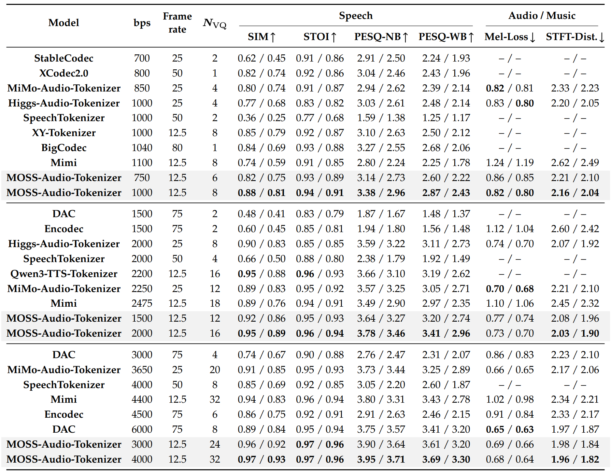

# MOSS Audio Tokenizer

<br>

<p align="center" style="display:flex; justify-content:center; align-items:center; gap:24px;">
  
  
</p>

<div align="center">
  <a href="https://huggingface.co/OpenMOSS-Team/MOSS-Audio-Tokenizer"></a>
  <a href="https://modelscope.cn/models/openmoss/MOSS-Audio-Tokenizer"></a>
  <a href="https://mosi.cn/#models"></a>
  <a href="https://arxiv.org/"></a>
  <br>
  <a href="https://github.com/OpenMOSS/MOSS-Audio-Tokenizer"></a>
  <a href="https://x.com/Open_MOSS"></a>
  <a href="https://discord.gg/fvm5TaWjU3"></a>
</div>

## Introduction
**MOSS Audio Tokenizer** is a unified discrete audio tokenizer based on the **Cat** (**C**ausal **A**udio **T**okenizer with **T**ransformer) architecture. Scaling to 1.6 billion parameters, it functions as a unified discrete interface, delivering both lossless-quality reconstruction and high-level semantic alignment.

**Key Features:**

*   **Extreme Compression & Variable Bitrate**: It compresses 24kHz raw audio into a remarkably low frame rate of 12.5Hz. Utilizing a 32-layer Residual Vector Quantizer (RVQ), it supports high-fidelity reconstruction across a wide range of bitrates, from 0.125kbps to 4kbps.
*   **Pure Transformer Architecture**: The model features a "CNN-free" homogeneous architecture built entirely from Causal Transformer blocks. With 1.6B combined parameters (Encoder + Decoder), it ensures exceptional scalability and supports low-latency streaming inference.
*   **Large-Scale General Audio Training**: Trained on 3 million hours of diverse audio data, the model excels at encoding and reconstructing all audio domains, including speech, sound effects, and music.
*   **Unified Semantic-Acoustic Representation**: While achieving state-of-the-art reconstruction quality, Cat produces discrete tokens that are "semantic-rich," making them ideal for downstream tasks like speech understanding (ASR) and generation (TTS).
*   **Fully Trained From Scratch**: Cat does not rely on any pretrained encoders (such as HuBERT or Whisper) or distillation from teacher models. All representations are learned autonomously from raw data.
*   **End-to-End Joint Optimization**: All components—including the encoder, quantizer, decoder, discriminator, and a decoder-only LLM for semantic alignment—are optimized jointly in a single unified training pipeline.

**Summary:**
By combining a simple, scalable architecture with massive-scale data, the Cat architecture overcomes the bottlenecks of traditional audio tokenizers. It provides a robust, high-fidelity, and semantically grounded interface for the next generation of native audio foundation models.


This repository is the official implementation of Moss Audio Tokenizer.

<br>
<p align="center">
     <br>
    Architecture of Moss Audio Tokenizer
</p>
<br>

## Quick Link
- [Introduction](#introduction)
- [Release](#release)
- [Model List](#model-list)
  - [MOSS Audio Tokenizer](#moss-audio-tokenizer)
  - [MOSS-TTS Family](#moss-tts-family)
- [Installation](#installation)
- [Usage](#usage)
  - [Reconstruction](#reconstruction)
  - [Streaming](#streaming)
- [Quick Start](#quick-start)
  - [Loading Model](#loading-model)
  - [Testing Model](#testing-model)
- [Evaluation Metrics](#evaluation-metrics)
  - [LibriSpeech Speech Metrics](#librispeech-speech-metrics-moss-audio-tokenizer-vs-open-source-tokenizers)
- [Citation](#citation)
- [License](#license)

## Release
- [2026/2/10] 🎉 Released **MOSS-TTS Family**. Please refer to our [blog](https://mosi.cn/#models) for details; models and docs can be found in the [MOSS-TTS GitHub repository](https://github.com/OpenMOSS/MOSS-TTS).
- [2026/2/9] 🔥 We released code and checkpoints of Moss Audio Tokenizer. Checkout the [paper](https://github.com/OpenMOSS/MOSS-Audio-Tokenizer.git), [Hugging Face weights](https://huggingface.co/OpenMOSS-Team/MOSS-Audio-Tokenizer), and [ModelScope weights](https://modelscope.cn/models/openmoss/MOSS-Audio-Tokenizer).

## Model List

> For MOSS‑TTS Family models and docs, visit the GitHub repo: https://github.com/OpenMOSS/MOSS-TTS

### Moss Audio Tokenizer
| Model | Hugging Face | ModelScope |
|:-----:|:---------------:|:----------:|
| **Moss Audio Tokenizer** | [](https://huggingface.co/OpenMOSS-Team/MOSS-Audio-Tokenizer) | [](https://modelscope.cn/models/openmoss/MOSS-Audio-Tokenizer) |

### MOSS-TTS Family
| Model | Hugging Face | ModelScope |
|:-----:|:---------------:|:----------:|
| **MOSS-TTS** | [](https://huggingface.co/OpenMOSS-Team/MOSS-TTS) | [](https://modelscope.cn/models/openmoss/MOSS-TTS) |
| **MOSS-TTS-Local-Transformer** | [](https://huggingface.co/OpenMOSS-Team/MOSS-TTS-Local-Transformer) | [](https://modelscope.cn/models/openmoss/MOSS-TTS-Local-Transformer) |
| **MOSS-TTSD** | [](https://huggingface.co/OpenMOSS-Team/MOSS-TTSD-v1.0) | [](https://modelscope.cn/models/openmoss/MOSS-TTSD-v1.0) |
| **MOSS-TTS-Realtime** | [](https://huggingface.co/OpenMOSS-Team/MOSS-TTS-Realtime) | [](https://modelscope.cn/models/openmoss/MOSS-TTS-Realtime) |
| **MOSS-VoiceGenerator** | [](https://huggingface.co/OpenMOSS-Team/MOSS-VoiceGenerator) | [](https://modelscope.cn/models/openmoss/MOSS-VoiceGenerator) |
| **MOSS-SoundEffect** | [](https://huggingface.co/OpenMOSS-Team/MOSS-SoundEffect) | [](https://modelscope.cn/models/openmoss/MOSS-SoundEffect) |

## Installation

```bash
# Clone the repository
git clone https://github.com/OpenMOSS/MOSS-Audio-Tokenizer.git
cd MOSS-Audio-Tokenizer

# Install dependencies
conda create -n moss-audio-tokenizer python=3.10 -y
conda activate moss-audio-tokenizer
pip install -r requirements.txt
```


## Usage

### Reconstruction

```python
import torch
from transformers import AutoModel
import torchaudio

repo_id = "OpenMOSS-Team/MOSS-Audio-Tokenizer"
model = AutoModel.from_pretrained(repo_id, trust_remote_code=True).eval()

wav, sr = torchaudio.load('demo/demo_gt.wav')
if sr != model.sampling_rate:
    wav = torchaudio.functional.resample(wav, sr, model.sampling_rate)
wav = wav.unsqueeze(0)
enc = model.encode(wav, return_dict=True)
print(f"enc.audio_codes.shape: {enc.audio_codes.shape}")
dec = model.decode(enc.audio_codes, return_dict=True)
print(f"dec.audio.shape: {dec.audio.shape}")
wav = dec.audio.squeeze(0)
torchaudio.save("demo/demo_rec.wav", wav, sample_rate=model.sampling_rate)

# Decode using only the first 8 layers of the RVQ
dec_rvq8 = model.decode(enc.audio_codes[:8], return_dict=True)
wav_rvq8 = dec_rvq8.audio.squeeze(0)
torchaudio.save("demo/demo_rec_rvq8.wav", wav_rvq8, sample_rate=model.sampling_rate)
```

### Streaming

`MossAudioTokenizerModel.encode` and `MossAudioTokenizerModel.decode` support simple streaming via a `chunk_duration`
argument.

- `chunk_duration` is expressed in seconds.
- It must be <= `MossAudioTokenizerConfig.causal_transformer_context_duration`.
- `chunk_duration * MossAudioTokenizerConfig.sampling_rate` must be divisible by `MossAudioTokenizerConfig.downsample_rate`.
- Streaming chunking only supports `batch_size=1`.

```python
import torch
from transformers import AutoModel

repo_id = "OpenMOSS-Team/MOSS-Audio-Tokenizer"
model = AutoModel.from_pretrained(repo_id, trust_remote_code=True).eval()
audio = torch.randn(1, 1, 3200)  # dummy waveform

# 0.08s @ 24kHz = 1920 samples, divisible by downsample_rate=1920
enc = model.encode(audio, return_dict=True, chunk_duration=0.08)
dec = model.decode(enc.audio_codes, return_dict=True, chunk_duration=0.08)
```

## Quick Start

### Loading Model
```python
from transformers import AutoModel
model = AutoModel.from_pretrained("OpenMOSS-Team/MOSS-Audio-Tokenizer", trust_remote_code=True).eval()
```

### Testing Model
```bash
conda activate moss-audio-tokenizer
cd MOSS-Audio-Tokenizer
python demo/test_reconstruction.py
```


## Evaluation Metrics

The table below compares the reconstruction quality of open-source audio tokenizers with Moss Audio Tokenizer on speech and audio/music data.

- Speech metrics are evaluated on LibriSpeech test-clean (English) and AISHELL-2 (Chinese), reported as EN/ZH.
- Audio metrics are evaluated on the AudioSet evaluation subset, while music metrics are evaluated on MUSDB, reported as audio/music.
- STFT-Dist. denotes the STFT distance.
- Higher is better for speech metrics, while lower is better for audio/music metrics (Mel-Loss, STFT-Dist.).
- Nvq denotes the number of quantizers.

<br>
<p align="center">
     <br>
    Reconstruction quality comparison of open-source audio tokenizers on speech and audio/music data.
</p>
<br>

### LibriSpeech Speech Metrics (MOSS Audio Tokenizer vs. Open-source Tokenizers)

The plots below compare our MOSS Audio Tokenizer model with other open-source speech tokenizers on the LibriSpeech dataset, evaluated with SIM, STOI, PESQ-NB, and PESQ-WB (higher is better).
We control the bps of the same model by adjusting the number of RVQ codebooks used during inference.

<br>
<p align="center">
     <br>
</p>
<br>


## Citation
If you use this code or result in your paper, please cite our work as:
```tex

```


## License
<!-- TODO: check and add license -->
Moss Audio Tokenizer is released under the Apache 2.0 license.
