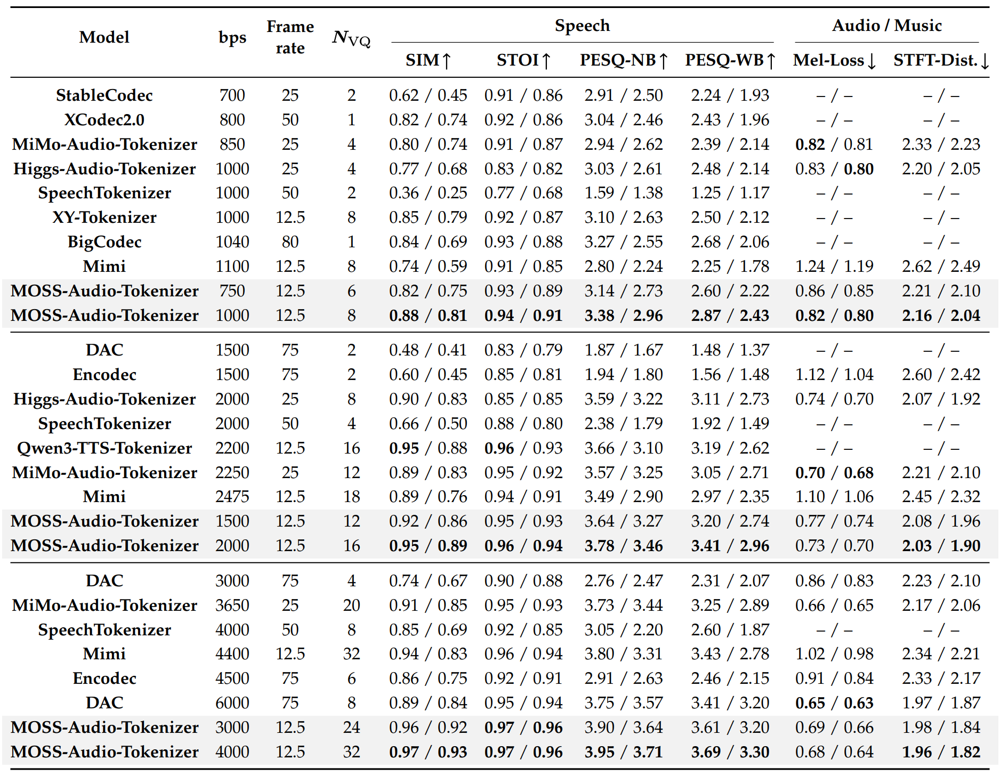
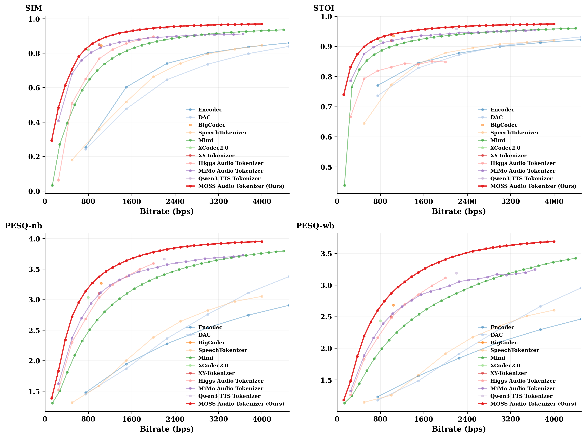

# MOSS-Audio-Tokenizer

<br>

<p align="center">
  
  &nbsp;&nbsp;&nbsp;&nbsp;
  
</p>

<div align="center">
  <a href="https://huggingface.co/OpenMOSS-Team/MOSS-Audio-Tokenizer"></a>
  <a href="https://modelscope.cn/models/openmoss/MOSS-Audio-Tokenizer"></a>
  <a href="https://mosi.cn/#models"></a>
  <a href="https://arxiv.org/abs/2602.10934"></a>
  <br>
  <a href="https://github.com/OpenMOSS/MOSS-Audio-Tokenizer"></a>
  <a href="https://x.com/Open_MOSS"></a>
  <a href="https://discord.gg/fvm5TaWjU3"></a>
</div>

## Introduction
This is the code for MOSS-Audio-Tokenizer presented in the [MOSS-Audio-Tokenizer: Scaling Audio Tokenizers for Future Audio Foundation Models](https://arxiv.org/abs/2602.10934). **MOSS-Audio-Tokenizer** is a unified discrete audio tokenizer based on the **Cat** (**C**ausal **A**udio **T**okenizer with **T**ransformer) architecture. Scaling to 1.6 billion parameters, it functions as a unified discrete interface, delivering both lossless-quality reconstruction and high-level semantic alignment.

**Key Features:**

*   **Extreme Compression & Variable Bitrate**: It compresses 24kHz raw audio into a remarkably low frame rate of 12.5Hz. Utilizing a 32-layer Residual Vector Quantizer (RVQ), it supports high-fidelity reconstruction across a wide range of bitrates, from 0.125kbps to 4kbps.
*   **Pure Transformer Architecture**: The model features a "CNN-free" homogeneous architecture built entirely from Causal Transformer blocks. With 1.6B combined parameters (Encoder + Decoder), it ensures exceptional scalability and supports low-latency streaming inference.
*   **Large-Scale General Audio Training**: Trained on 3 million hours of diverse audio data, the model excels at encoding and reconstructing all audio domains, including speech, sound effects, and music.
*   **Unified Semantic-Acoustic Representation**: While achieving state-of-the-art reconstruction quality, Cat produces discrete tokens that are "semantic-rich," making them ideal for downstream tasks like speech understanding (ASR) and generation (TTS).
*   **Fully Trained From Scratch**: Cat does not rely on any pretrained encoders (such as HuBERT or Whisper) or distillation from teacher models. All representations are learned autonomously from raw data.
*   **End-to-End Joint Optimization**: All components—including the encoder, quantizer, decoder, discriminator, and a decoder-only LLM for semantic alignment—are optimized jointly in a single unified training pipeline.

**Summary:**
By combining a simple, scalable architecture with massive-scale data, the Cat architecture overcomes the bottlenecks of traditional audio tokenizers. It provides a robust, high-fidelity, and semantically grounded interface for the next generation of native audio foundation models.


This repository is the official implementation of MOSS-Audio-Tokenizer.

<br>
<p align="center">
     <br>
    Architecture of MOSS-Audio-Tokenizer
</p>
<br>

## Quick Link
- [Introduction](#introduction)
- [Release](#release)
- [Model List](#model-list)
  - [MOSS-Audio-Tokenizer](#moss-audio-tokenizer)
  - [MOSS-TTS Family](#moss-tts-family)
- [HuggingFace (PyTorch)](#huggingface-pytorch)
  - [Installation](#installation)
  - [Usage](#usage)
- [ONNX Runtime](#onnx-runtime)
  - [Installation](#installation-1)
  - [Usage](#usage-1)
- [Quick Start](#quick-start)
  - [Loading Model (HuggingFace)](#loading-model-huggingface)
  - [Testing Model](#testing-model)
- [Evaluation Metrics](#evaluation-metrics)
  - [LibriSpeech Speech Metrics](#librispeech-speech-metrics-moss-audio-tokenizer-vs-open-source-tokenizers)
- [Citation](#citation)
- [License](#license)

## Release
- [2026/3/4] 🚀 Added **ONNX Runtime** and **TensorRT** inference backends for MOSS-Audio-Tokenizer, enabling high-performance deployment without PyTorch dependency. See `onnx/` and `trt/` directories for details.
- [2026/2/12] 🌟 We released the technical report: **MOSS-Audio-Tokenizer: Scaling Audio Tokenizers for Future Audio Foundation Models**. Read the [paper](https://arxiv.org/abs/2602.10934).
- [2026/2/10] 🎉 Released **MOSS-TTS Family**. Please refer to our [blog](https://mosi.cn/#models) for details; models and docs can be found in the [MOSS-TTS GitHub repository](https://github.com/OpenMOSS/MOSS-TTS).
- [2026/2/9] 🔥 We released code and checkpoints of MOSS-Audio-Tokenizer. Check out the [GitHub repository](https://github.com/OpenMOSS/MOSS-Audio-Tokenizer), [Hugging Face weights](https://huggingface.co/OpenMOSS-Team/MOSS-Audio-Tokenizer), and [ModelScope weights](https://modelscope.cn/models/openmoss/MOSS-Audio-Tokenizer).

## Model List

> For MOSS‑TTS Family models and docs, visit the GitHub repo: https://github.com/OpenMOSS/MOSS-TTS

### MOSS-Audio-Tokenizer
| Model | Hugging Face | ModelScope |
|:-----:|:---------------:|:----------:|
| **MOSS-Audio-Tokenizer** | [](https://huggingface.co/OpenMOSS-Team/MOSS-Audio-Tokenizer) | [](https://modelscope.cn/models/openmoss/MOSS-Audio-Tokenizer) |
| **MOSS-Audio-Tokenizer(ONNX Runtime)** | [](https://huggingface.co/OpenMOSS-Team/MOSS-Audio-Tokenizer-ONNX) | [](https://modelscope.cn/models/openmoss/MOSS-Audio-Tokenizer-ONNX) |


### MOSS-TTS Family
| Model | Hugging Face | ModelScope |
|:-----:|:---------------:|:----------:|
| **MOSS-TTS** | [](https://huggingface.co/OpenMOSS-Team/MOSS-TTS) | [](https://modelscope.cn/models/openmoss/MOSS-TTS) |
| **MOSS-TTS-Local-Transformer** | [](https://huggingface.co/OpenMOSS-Team/MOSS-TTS-Local-Transformer) | [](https://modelscope.cn/models/openmoss/MOSS-TTS-Local-Transformer) |
| **MOSS-TTSD** | [](https://huggingface.co/OpenMOSS-Team/MOSS-TTSD-v1.0) | [](https://modelscope.cn/models/openmoss/MOSS-TTSD-v1.0) |
| **MOSS-TTS-Realtime** | [](https://huggingface.co/OpenMOSS-Team/MOSS-TTS-Realtime) | [](https://modelscope.cn/models/openmoss/MOSS-TTS-Realtime) |
| **MOSS-VoiceGenerator** | [](https://huggingface.co/OpenMOSS-Team/MOSS-VoiceGenerator) | [](https://modelscope.cn/models/openmoss/MOSS-VoiceGenerator) |
| **MOSS-SoundEffect** | [](https://huggingface.co/OpenMOSS-Team/MOSS-SoundEffect) | [](https://modelscope.cn/models/openmoss/MOSS-SoundEffect) |

## HuggingFace (PyTorch)

### Installation

```bash
# Clone the repository
git clone https://github.com/OpenMOSS/MOSS-Audio-Tokenizer.git
cd MOSS-Audio-Tokenizer

# Install dependencies
conda create -n moss-audio-tokenizer python=3.10 -y
conda activate moss-audio-tokenizer
pip install -r requirements.txt
```

### Usage

#### Reconstruction

```python
import torch
from transformers import AutoModel
import torchaudio

repo_id = "OpenMOSS-Team/MOSS-Audio-Tokenizer"
model = AutoModel.from_pretrained(repo_id, trust_remote_code=True).eval()

wav, sr = torchaudio.load('demo/demo_gt.wav')
if sr != model.sampling_rate:
    wav = torchaudio.functional.resample(wav, sr, model.sampling_rate)
wav = wav.unsqueeze(0)
enc = model.encode(wav, return_dict=True)
print(f"enc.audio_codes.shape: {enc.audio_codes.shape}")
dec = model.decode(enc.audio_codes, return_dict=True)
print(f"dec.audio.shape: {dec.audio.shape}")
wav = dec.audio.squeeze(0)
torchaudio.save("demo/demo_rec.wav", wav, sample_rate=model.sampling_rate)

# Decode using only the first 8 layers of the RVQ
dec_rvq8 = model.decode(enc.audio_codes[:8], return_dict=True)
wav_rvq8 = dec_rvq8.audio.squeeze(0)
torchaudio.save("demo/demo_rec_rvq8.wav", wav_rvq8, sample_rate=model.sampling_rate)
```

#### Streaming

`MossAudioTokenizerModel.encode` and `MossAudioTokenizerModel.decode` support simple streaming via a `chunk_duration` argument.

- `chunk_duration` is expressed in seconds.
- It must be <= `MossAudioTokenizerConfig.causal_transformer_context_duration`.
- `chunk_duration * MossAudioTokenizerConfig.sampling_rate` must be divisible by `MossAudioTokenizerConfig.downsample_rate`.
- Streaming chunking only supports `batch_size=1`.

```python
import torch
from transformers import AutoModel

repo_id = "OpenMOSS-Team/MOSS-Audio-Tokenizer"
model = AutoModel.from_pretrained(repo_id, trust_remote_code=True).eval()
audio = torch.randn(1, 1, 3200)  # dummy waveform

# 0.08s @ 24kHz = 1920 samples, divisible by downsample_rate=1920
enc = model.encode(audio, return_dict=True, chunk_duration=0.08)
dec = model.decode(enc.audio_codes, return_dict=True, chunk_duration=0.08)
```

## ONNX Runtime

### Installation

```bash
# From repository root
mkdir weights
cd weights
git clone https://huggingface.co/OpenMOSS-Team/MOSS-Audio-Tokenizer-ONNX
cd -

# CPU version
pip install onnxruntime librosa soundfile

# GPU version (CUDA/TensorRT)
pip install onnxruntime-gpu librosa soundfile
```

### Usage

```python
import sys
sys.path.append(".")
from pathlib import Path

import librosa
import soundfile as sf
from onnx.inference import OnnxAudioTokenizer

model = OnnxAudioTokenizer(
    encoder_path=Path("weights/MOSS-Audio-Tokenizer-ONNX/encoder.onnx"),
    decoder_path=Path("weights/MOSS-Audio-Tokenizer-ONNX/decoder.onnx"),
    n_quantizers=32,
    use_gpu=True,
)

wav, sr = sf.read("demo/demo_gt.wav")
if sr != model.sample_rate:
    wav = librosa.resample(wav, orig_sr=sr, target_sr=model.sample_rate)
if wav.ndim > 1:
    wav = wav.mean(axis=1)

# Encode: audio -> discrete codes
audio_codes = model.encode(wav, n_quantizers=32)
print(f"audio_codes.shape: {audio_codes.shape}")  # (T', 32)

# Decode: full 32 RVQ layers
reconstructed = model.decode(audio_codes, n_quantizers=32)
sf.write("demo/demo_rec_onnx.wav", reconstructed, model.sample_rate)

# Decode: only first 8 RVQ layers (lower bitrate)
reconstructed_rvq8 = model.decode(audio_codes, n_quantizers=8)
sf.write("demo/demo_rec_onnx_rvq8.wav", reconstructed_rvq8, model.sample_rate)
```

## Quick Start

### Loading Model (HuggingFace)
```python
from transformers import AutoModel
model = AutoModel.from_pretrained("OpenMOSS-Team/MOSS-Audio-Tokenizer", trust_remote_code=True).eval()
```

### Testing Model

#### HuggingFace
```bash
conda activate moss-audio-tokenizer
cd MOSS-Audio-Tokenizer
python demo/test_reconstruction.py
```

#### ONNX Runtime
Run the ONNX code in the section above (ONNX Runtime -> Usage).

## Evaluation Metrics

The table below compares the reconstruction quality of open-source audio tokenizers with MOSS-Audio-Tokenizer on speech and audio/music data.

- Speech metrics are evaluated on LibriSpeech test-clean (English) and AISHELL-2 (Chinese), reported as EN/ZH.
- Audio metrics are evaluated on the AudioSet evaluation subset, while music metrics are evaluated on MUSDB, reported as audio/music.
- STFT-Dist. denotes the STFT distance.
- Higher is better for speech metrics, while lower is better for audio/music metrics (Mel-Loss, STFT-Dist.).
- Nvq denotes the number of quantizers.

<br>
<p align="center">
     <br>
    Reconstruction quality comparison of open-source audio tokenizers on speech and audio/music data.
</p>
<br>

### LibriSpeech Speech Metrics (MOSS-Audio-Tokenizer vs. Open-source Tokenizers)

The plots below compare our MOSS-Audio-Tokenizer model with other open-source speech tokenizers on the LibriSpeech dataset, evaluated with SIM, STOI, PESQ-NB, and PESQ-WB (higher is better).
We control the bps of the same model by adjusting the number of RVQ codebooks used during inference.

<br>
<p align="center">
     <br>
</p>
<br>


## Citation
If you use this code or result in your paper, please cite our work as:
```tex
@misc{gong2026mossaudiotokenizerscalingaudiotokenizers,
      title={MOSS-Audio-Tokenizer: Scaling Audio Tokenizers for Future Audio Foundation Models}, 
      author={Yitian Gong and Kuangwei Chen and Zhaoye Fei and Xiaogui Yang and Ke Chen and Yang Wang and Kexin Huang and Mingshu Chen and Ruixiao Li and Qingyuan Cheng and Shimin Li and Xipeng Qiu},
      year={2026},
      eprint={2602.10934},
      archivePrefix={arXiv},
      primaryClass={cs.SD},
      url={https://arxiv.org/abs/2602.10934}, 
}
```


## License
<!-- TODO: check and add license -->
MOSS-Audio-Tokenizer is released under the Apache 2.0 license.

## Star History
[](https://www.star-history.com/#OpenMOSS/MOSS-Audio-Tokenizer&type=date&legend=top-left)
